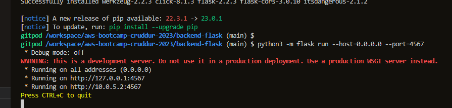
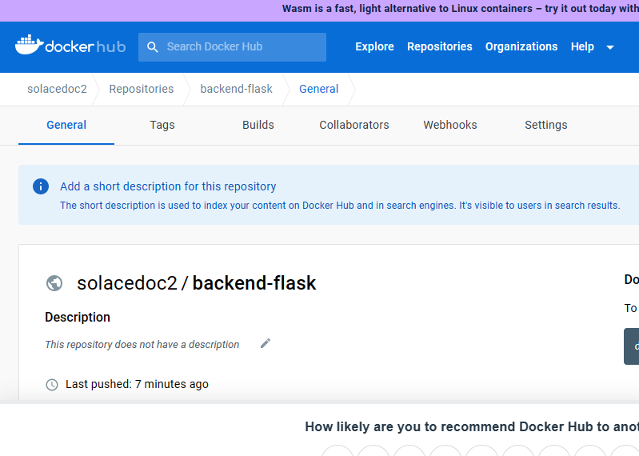
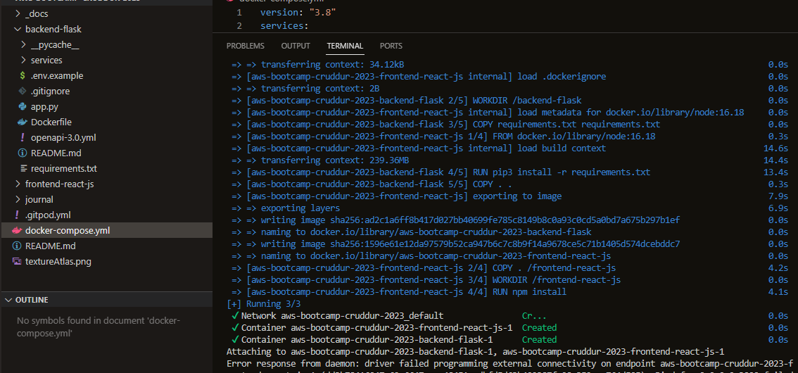
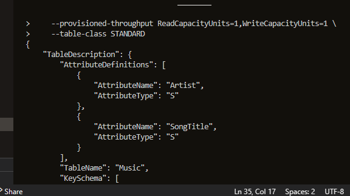
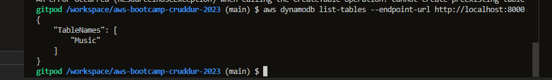

# Week 1 — App Containerization
For week challenge am able to do the following:
## Set environment variable.
Am able to set environment variable successfully 
 

i intsalled pip3
  

Run the dockerfile CMD as an external script.
 
 
 Am able to build container successfully.
   
   Also am able to push and tag a image to DockerHub
  .
  
  This is the evidence of image push in dockerhub
   .
   am able to craete and run multiple container by creating docker compose file and docker-compose-yml. 
   I use docker compose command to run the container and is successful
   

Document the Notification Endpoint for the OpenAI Document
 
Write a Flask Backend Endpoint for Notifications
 
Write a React Page for Notifications
 
Run DynamoDB Local Container and ensure it works.
Am ableto create table and list the table to confirm it.
 
  
 Run Postgres Container and ensure it works
 

 
